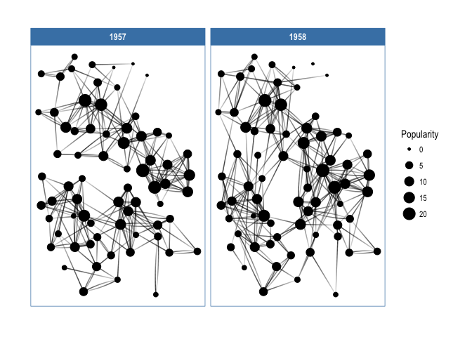

<!-- README.md is generated from README.Rmd. Please edit that file -->


ggraph
======

*/dʒiː.dʒɪˈrɑːf/* (or g-giraffe)

[](https://travis-ci.org/thomasp85/ggraph) [](https://ci.appveyor.com/project/thomasp85/ggraph) [](https://CRAN.R-project.org/package=ggraph) [](https://CRAN.R-project.org/package=ggraph)

A grammar of graphics for relational data
-----------------------------------------

ggraph is an extension of [`ggplot2`](http://ggplot2.tidyverse.org) aimed at supporting relational data structures such as networks, graphs, and trees. While it builds upon the foundation of `ggplot2` and its API it comes with its own self-contained set of geoms, facets, etc., as well as adding the concept of *layouts* to the grammar.

### An example

``` r
library(ggraph)
#> Loading required package: ggplot2
library(igraph)
#> 
#> Attaching package: 'igraph'
#> The following objects are masked from 'package:stats':
#> 
#>     decompose, spectrum
#> The following object is masked from 'package:base':
#> 
#>     union

# Create graph of highschool friendships
graph <- graph_from_data_frame(highschool)
V(graph)$Popularity <- degree(graph, mode = 'in')

# plot using ggraph
ggraph(graph, layout = 'kk') + 
    geom_edge_fan(aes(alpha = ..index..), show.legend = FALSE) + 
    geom_node_point(aes(size = Popularity)) + 
    facet_edges(~year) + 
    theme_graph(foreground = 'steelblue', fg_text_colour = 'white')
```



### The core concepts

`ggraph` builds upon three core concepts that are quite easy to understand:

1.  [**The Layout**](http://www.data-imaginist.com/2017/ggraph-introduction-layouts/) defines how nodes are placed on the plot, that is, it is a conversion of the relational structure into an x and y value for each node in the graph. `ggraph` has access to all layout functions avaiable in `igraph` and furthermore provides a large selection of its own, such as hive plots, treemaps, and circle packing.
2.  [**The Nodes**](http://www.data-imaginist.com/2017/ggraph-introduction-nodes/) are the connected enteties in the relational structure. These can be plotted using the `geom_node_*()` family of geoms. Some node geoms make more sense for certain layouts, e.g. `geom_node_tile()` for treemaps and icicle plots, while others are more general purpose, e.g. `geom_node_point()`.
3.  [**The Edges**](http://www.data-imaginist.com/2017/ggraph-introduction-edges/) are the connections between the enteties in the relational structure. These can be visualized using the `geom_edge_*()` family of geoms that contain a lot of different edge types for different scenarios. Sometimes the edges are implied by the layout (e.g. with treemaps) and need not be plottet, but often some sort of line is warranted.

All of the tree concepts has been discussed in detail in dedicated blog posts that are also available as vignettes in the package. Please refer to these for more information.

### Supported data types

There are many different ways to store and work with relational data in R. Out of the box `ggraph` comes with first-class support for `igraph` and `dendrogram` objects, while `network` and `hclust` objects are supported through automatic conversion to one of the above. Users can add support for other data structures by writing a set of methods for that class. If this is of interest it is discussed further in the [layouts](http://www.data-imaginist.com/2017/ggraph-introduction-layouts/).

Installation
------------

`ggraph` is available through CRAN and can be installed with `install_packages('ggraph')`. The package is under active development though and the latest set of features can be obtained by installing from this repository using `devtools`

``` r
devtools::install_github('thomasp85/ggraph')
```

Related work
------------

`ggraph` is not the only package to provide some sort of support for relational data in `ggplot2`, though I'm fairly certain that it is the most ambituous. [`ggdendro`](https://CRAN.R-project.org/package=ggdendro) provides support for `dendrogram` and `hclust` objects through conversion of the structures into line segments that can then be plotted with `geom_segment()`. [`ggtree`](http://bioconductor.org/packages/ggtree/) provides more extensive support for all things tree-related, though it lacks some of the layouts and edge types that `ggraph` offers (it has other features that `ggraph` lacks though). For more standard *hairball* network plots [`ggnetwork`](https://CRAN.R-project.org/package=ggnetwork), [`geomnet`](https://CRAN.R-project.org/package=geomnet), and [`GGally`](https://CRAN.R-project.org/package=GGally) all provide some functionality though none of them are as extensive in scope as `ggraph`.
