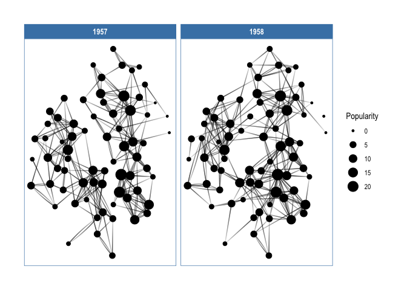

<!-- README.md is generated from README.Rmd. Please edit that file -->

# ggraph 

<!-- badges: start -->

[](https://github.com/thomasp85/ggraph/actions)
[](https://CRAN.R-project.org/package=ggraph)
[](https://CRAN.R-project.org/package=ggraph)
[](https://codecov.io/gh/thomasp85/ggraph?branch=master)
<!-- badges: end -->

*/dʒiː.dʒɪˈrɑːf/* (or g-giraffe)

## A grammar of graphics for relational data

ggraph is an extension of [`ggplot2`](https://ggplot2.tidyverse.org)
aimed at supporting relational data structures such as networks, graphs,
and trees. While it builds upon the foundation of `ggplot2` and its API
it comes with its own self-contained set of geoms, facets, etc., as well
as adding the concept of *layouts* to the grammar.

### An example

``` r
library(ggraph)
#> Loading required package: ggplot2
library(tidygraph)
#> 
#> Attaching package: 'tidygraph'
#> The following object is masked from 'package:stats':
#> 
#>     filter

# Create graph of highschool friendships
graph <- as_tbl_graph(highschool) %>% 
    mutate(Popularity = centrality_degree(mode = 'in'))

# plot using ggraph
ggraph(graph, layout = 'kk') + 
    geom_edge_fan(aes(alpha = stat(index)), show.legend = FALSE) + 
    geom_node_point(aes(size = Popularity)) + 
    facet_edges(~year) + 
    theme_graph(foreground = 'steelblue', fg_text_colour = 'white')
```

<!-- -->

### The core concepts

`ggraph` builds upon three core concepts that are quite easy to
understand:

1.  [**The
    Layout**](https://www.data-imaginist.com/2017/ggraph-introduction-layouts/)
    defines how nodes are placed on the plot, that is, it is a
    conversion of the relational structure into an x and y value for
    each node in the graph. `ggraph` has access to all layout functions
    available in `igraph` and furthermore provides a large selection of
    its own, such as hive plots, treemaps, and circle packing.
2.  [**The
    Nodes**](https://www.data-imaginist.com/2017/ggraph-introduction-nodes/)
    are the connected entities in the relational structure. These can be
    plotted using the `geom_node_*()` family of geoms. Some node geoms
    make more sense for certain layouts, e.g. `geom_node_tile()` for
    treemaps and icicle plots, while others are more general purpose,
    e.g. `geom_node_point()`.
3.  [**The
    Edges**](https://www.data-imaginist.com/2017/ggraph-introduction-edges/)
    are the connections between the entities in the relational
    structure. These can be visualized using the `geom_edge_*()` family
    of geoms that contain a lot of different edge types for different
    scenarios. Sometimes the edges are implied by the layout (e.g. with
    treemaps) and need not be plotted, but often some sort of line is
    warranted.

All of the tree concepts have been discussed in detail in dedicated blog
posts that are also available as vignettes in the package. Please refer
to these for more information.

> **Note:** The linked blog posts are based on ggraph v1. After ggraph
> v1.1 the underlying implementation was moved to tidygraph and cleaned
> up, but this resulted in some breaking changes in the process.
> Therefore the vignette versions are generally recommended as they have
> been updated.

### Supported data types

There are many different ways to store and work with relational data in
R. `ggraph` is built upon `tidygraph` and the large swath of data
structures it supports are thus natively supported in `ggraph`. In order
to get a data type supported by `ggraph`, simply provide an
`as_tbl_graph` method for it.

## Installation

`ggraph` is available through CRAN and can be installed with
`install.packages('ggraph')`. The package is under active development
though and the latest set of features can be obtained by installing from
this repository using `devtools`

``` r
devtools::install_github('thomasp85/ggraph')
```

## Related work

`ggraph` is not the only package to provide some sort of support for
relational data in `ggplot2`, though I’m fairly certain that it is the
most ambitious.
[`ggdendro`](https://CRAN.R-project.org/package=ggdendro) provides
support for `dendrogram` and `hclust` objects through conversion of the
structures into line segments that can then be plotted with
`geom_segment()`. [`ggtree`](http://bioconductor.org/packages/ggtree/)
provides more extensive support for all things tree-related, though it
lacks some of the layouts and edge types that `ggraph` offers (it has
other features that `ggraph` lacks though). For more standard *hairball*
network plots
[`ggnetwork`](https://CRAN.R-project.org/package=ggnetwork),
[`geomnet`](https://CRAN.R-project.org/package=geomnet), and
[`GGally`](https://CRAN.R-project.org/package=GGally) all provide some
functionality though none of them are as extensive in scope as `ggraph`.

## Code of Conduct

Please note that the ‘ggraph’ project is released with a [Contributor
Code of
Conduct](https://ggraph.data-imaginist.com/CODE_OF_CONDUCT.html). By
contributing to this project, you agree to abide by its terms.
